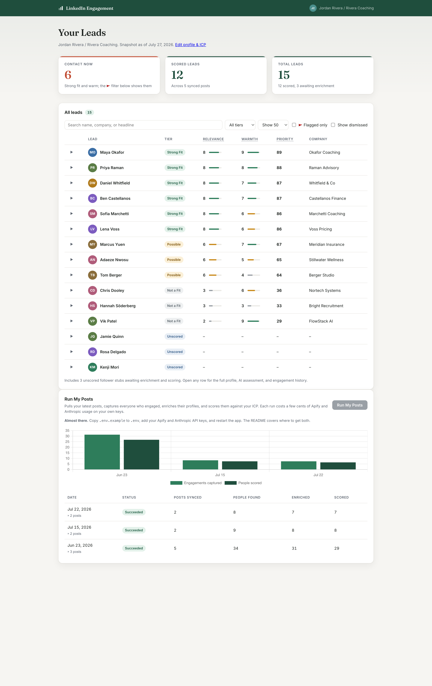

# LinkedIn Engagement

A self-hosted dashboard that turns the people engaging with your LinkedIn posts into a scored, prioritized lead list.

You post on LinkedIn. People like and comment. Some of them are your next clients, and they are buried in a notification feed that forgets them within a day. This app pulls the engagers from your recent posts, enriches their profiles, scores each person against *your* ideal client profile with AI, and hands you one clean list with the strongest leads flagged at the top.



## How it works

1. **Sync posts.** A pipeline run pulls your latest posts (or months of history on the first run).
2. **Capture engagers.** Every reaction and comment on those posts becomes a lead record with its engagement history.
3. **Enrich.** Each person's profile (headline, about, followers) is scraped, with a confidence score; low-confidence matches are quarantined for manual review instead of being presented as real leads.
4. **Score.** An AI assessment reads each profile against your ideal client profile and detects signals; deterministic point tables turn those signals into 1-10 Relevance and Warmth scores, so scores are reproducible run to run. The AI never picks the number.
5. **Work the list.** Leads are ranked by priority, with strong-fit warm leads flagged. Open any row for the profile, the AI's reasoning, and the full engagement history; dismiss or snooze anyone who doesn't belong.

Runs execute on a durable background worker: the job queue lives in the database, progress streams into the UI, and an interrupted run resumes where it left off.

## Quick start

Requires [Node.js](https://nodejs.org) 20 or newer.

```bash
git clone https://github.com/jparchmentconsulting/linkedin-engagement.git
cd linkedin-engagement
npm install
npm run dev
```

Open [http://localhost:3000](http://localhost:3000). The one-time setup screen asks for your name, your LinkedIn profile URL, and a description of your ideal client. That description is the entire scoring rubric, so write it in terms visible on a LinkedIn profile (role, niche, seniority) and name your exclusions explicitly. To change it later, open [http://localhost:3000/setup](http://localhost:3000/setup).

The database is a local SQLite file (`prisma/dev.db`), created automatically. No login, no database server, no configuration needed to explore the app.

### Add your API keys (needed for pipeline runs)

Runs scrape via [Apify](https://apify.com) and score via the [Anthropic API](https://console.anthropic.com), each on your own key:

```bash
cp .env.example .env
```

Fill in the two values, restart `npm run dev`, and press **Run My Posts**. `.env.example` documents where to get each key. A run at default settings (5 posts) costs a few cents across both services; the per-run post count and a one-time history backfill are configurable on the setup screen.

## Usage notes

- **Relevance** is fit to your ideal client profile: 8 = strong fit, 6 = partial, 3 = no match, 2 = hit one of your stated exclusions.
- **Warmth** measures the engagement pattern: comments count most, breadth across posts adds, a single like barely registers.
- **Contact now** flags leads with relevance ≥ 7 and warmth ≥ 6; the 🚩 filter shows exactly those. A manual fit override from the lead row wins over the AI tier either way.
- **Dismiss** hides a lead reversibly; **Erase permanently** deletes the person and every derived record, for good.
- Scores never go stale: fit tier, priority, and the outreach flag are computed at read time, not stored.
- Everything stays on your machine. The only network calls are to Apify and Anthropic during a run, on your keys.

## Responsible use

Scraping LinkedIn is against LinkedIn's terms of service. This tool only reads public engagement on your own posts and never logs into LinkedIn or automates any action on it, but you run it at your own risk and you are responsible for complying with the laws that apply to you (including data-protection laws, since scraped profiles are personal data). Be a good citizen: use the scores to start better conversations, not to spam people. The app sends nothing anywhere; any outreach you do happens outside it, by hand.

## Tech

Next.js 16 (App Router, Server Actions), Prisma + SQLite, Chart.js, Zod at the scraper-ingestion boundary, and the Anthropic Messages API with structured tool output. No auth layer: this is a single-user app meant to run on your own machine.

## Contributing

Issues and pull requests are welcome. See [CONTRIBUTING.md](CONTRIBUTING.md).

## License

[MIT](LICENSE) © Jenisha Parchment
